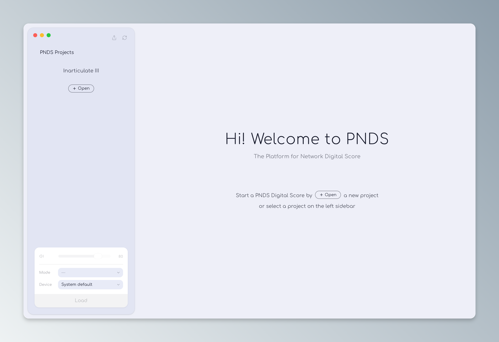
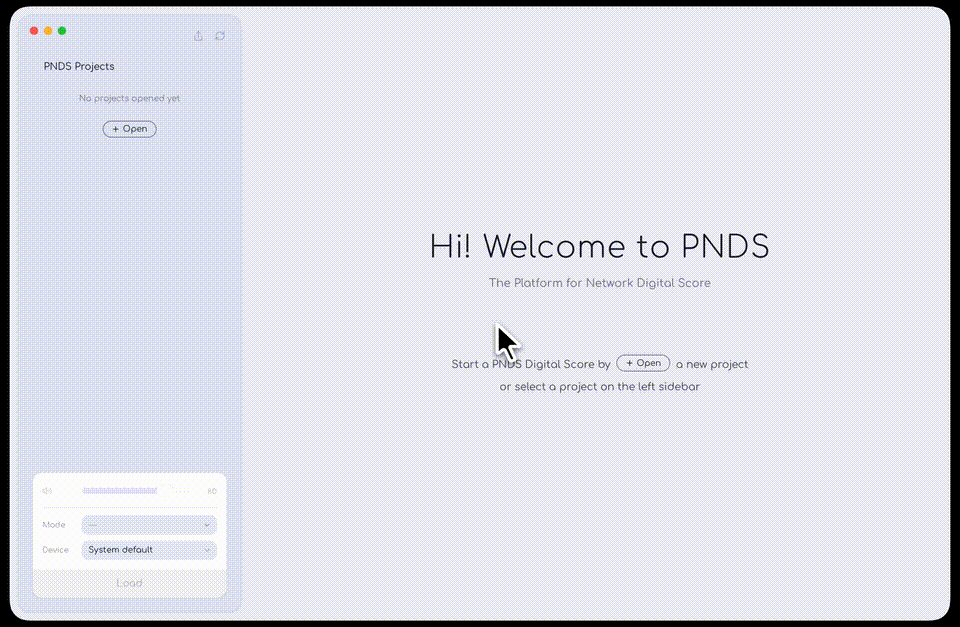

# PNDS

## Platform for Networked Digital Score

**中文** | [English](README.md)



PNDS 是一个面向网络化数字音乐演出的开放平台，用于创建、运行和组织多人参与的数字乐谱作品。

创作者把一份数字乐谱、一套声音引擎和一组网络交互规则，组织成一个独立的演出工程。

演出现场只需要一台 Mac 和一个路由器：PNDS App 打开这个工程，就地搭起一套本地多人数字音乐演奏系统。演奏者用自己的手机或平板扫码加入，他们的实时交互汇入数字乐谱，并驱动声音引擎发声。

围绕这条链路，PNDS 由三个部分组成。

### PNDS 数字乐谱工程框架

PNDS 工程（score project）是一个可以被 PNDS App 打开并运行的作品目录。
一个 PNDS 工程实例是《失语III》：https://github.com/xO-xN/inarticulate-iii

一个工程通常包含：

- 一个基于 Node.js 的数字乐谱服务器，提供演奏者页面与监视/指挥页面，并通过 Socket.IO 处理实时网络交互；
- 一个或多个已编译的 SuperCollider `.scsyndef` 声音定义文件；
- 一个 `manifest.json` 工程配置文件，声明服务器入口、页面端口、音频模式与声音资源。

工程自己决定乐谱视觉、演奏规则、交互方式与 OSC 参数；PNDS App 不规定这些内容。

创作者也可采用外置声音引擎（例如 SuperCollider、Max/MSP、Pure Data、Ableton Live 等），PNDS App 只负责将演奏者的交互转换为 OSC 消息发送给外置引擎。

### PNDS App

PNDS App 是一个 macOS 桌面应用，负责在演出现场运行 PNDS 工程：

- 打开本地 PNDS 工程并校验其运行资产；
- 启动工程的数字乐谱服务器，并部署到本地网络；
- 在 Internal 模式下启动内置的 SuperCollider 声音服务器（`scsynth`），加载工程的 `.scsyndef`；
- 管理音频模式、音频输出设备与总输出音量；
- 显示工程自己的监视/指挥界面；
- 在工程之间切换，并在退出时清理所有子进程。

### PNDS AI Skills

PNDS AI Skills 是一组面向创作者的 AI 辅助工具，用于在 PNDS 框架下制作作品，包括数字乐谱界面与交互设计、SuperCollider 声音引擎设计，以及工程配置与文档的生成与维护。

> **状态：正在开发中**，尚未公开发布。

## 第一版范围

当前开发完毕的第一版（V1）明确聚焦于：

- **macOS Apple Silicon** 桌面 Host；
- **同一局域网内**的演出：Host 电脑 + 手机/平板演奏者；
- 由用户主动选择并信任的**本地工程目录**；
- 通过内置 SuperCollider 声音服务器实现**离散多声道输出**（1–64 路），以及 External（OSC 到自定声音引擎）与 None（仅乐谱）模式；
- 随包 **Node.js 24** 运行时，工程无需在 Host 上另装 Node；
- **自动更新**与 App 内提示。

以下为**后续目标**，不属于 V1：

- 跨互联网、多地实时共奏；
- Intel Mac、Windows、Linux；
- 工程压缩包（`.pnds`）、在线工程库与工程下载。

## 下载与安装

从 [Releases](https://github.com/xO-xN/PNDS-App/releases/latest) 页面下载最新版本的 `.dmg`，打开后将 PNDS 拖入「应用程序」文件夹。

运行要求：搭载 Apple Silicon（M 系列芯片）的 Mac。

**首次打开**：V1 使用 ad-hoc 签名、未经 Apple 公证，macOS 会拦截并提示无法验证开发者。用以下任一方式打开即可，之后不再提示：

- 在「应用程序」中右键点击 PNDS，选择**打开**，在弹窗中再次点击**打开**；
- 或前往**系统设置 → 隐私与安全性**，在页面下方点击 **仍要打开**。

安装之后 PNDS 会自动检查更新，有新版本时在 App 内提示。

## PNDS App 如何使用

### 1. 准备 PNDS 工程

准备一个完整、可离线运行的工程目录，例如：

```text
Inarticulate III/
├── manifest.json
├── server.js
├── node_modules/                 # 仅在存在生产依赖时需要
├── public/
└── supercollider/
    └── synthdefs/
        └── inarticulate-iii.scsyndef
```

工程必须自带已安装好的 Node.js 生产依赖。PNDS App 在演出时不会执行安装步骤，也不依赖网络。

### 2. 连接本地网络演奏环境

将运行 PNDS App 的 Host 电脑接入本地网络，建议使用有线连接。演奏者设备（手机或平板）连接到同一网络。

### 3. 打开工程



在 PNDS App 中选择一个本地 PNDS 工程目录。

App 会：

- 读取并校验 `manifest.json`；
- 检查入口文件、依赖与声音资源；
- 让用户选择音频模式与输出设备；
- 根据工程需求启动声音引擎 / OSC 发送端口；
- 启动数字乐谱服务器

### 4. 演奏者加入数字乐谱

演奏者通过手机或平板扫描监视界面上的二维码，或直接访问 Host 的局域网地址，进入演奏者页面。

演奏者的交互通过 Socket.IO 发送到数字乐谱服务器。

### 5. 数字乐谱控制声音引擎

数字乐谱服务器根据作品规则，将演奏者交互转换为 OSC 消息，控制声音引擎发声。

音频模式由用户在 App 中选择：

| 模式           | 说明                                               |
| -------------- | -------------------------------------------------- |
| Internal Synth | 使用 App 内置的 `scsynth` 与工程自带的 `.scsyndef` |
| External Synth | 将 OSC 发送到用户指定的外部合成器或设备            |
| None           | 不使用音频，仅运行乐谱与网络交互                   |

### 6. 监视页面和演奏者页面

PNDS App 窗口显示的是工程的监视/指挥页面，本地网络中演奏者使用的是演奏者页面。

在 PNDS App 中，正常演出状态下，窗口只显示监视/指挥界面。将鼠标移到窗口左侧边缘时，PNDS 侧栏浮出，用于切换工程、更改音频模式、选择输出设备与调整总音量。

两类页面通过不同端口区分：

- 演奏者页面：工程 `manifest.json` 中的 `performerPort`，供手机/平板访问；
- 监视/指挥页面：`monitorPort`，供 PNDS App 显示。

它们的具体端口由工程声明；例如 `Inarticulate III` 使用 `6868` 与 `6869`。

## 开发

本仓库是 PNDS App 的实现（Tauri v2 + React + TypeScript）。

```bash
npm install        # 安装依赖
npm run tauri:dev  # 开发模式运行 App
npm run check:all  # 完整质量检查（typecheck / lint / ast-grep / prettier / clippy / tests）
```

开发规范与 agent 工作规则见 [`AGENTS.md`](AGENTS.md)；架构模式与详细开发文档见 [`docs/developer/`](docs/developer/README.md)。

## 相关文档

- [`docs/PNDS_SCORE_PROJECT_SPECIFICATION.md`](docs/PNDS_SCORE_PROJECT_SPECIFICATION.md)：数字乐谱工程目录、manifest、资产与网页要求。
- [`docs/PNDS_RUNTIME_CONTRACT.md`](docs/PNDS_RUNTIME_CONTRACT.md)：App/工程进程、health、音频总线与关闭契约。
- [`docs/PNDS_APP_REQUIREMENTS.md`](docs/PNDS_APP_REQUIREMENTS.md)：PNDS App 的 evergreen 产品要求与 Definition of Done。
- [`docs/README.md`](docs/README.md)：完整文档索引。

## 许可证

PNDS App 本体以 MIT 许可发布（见 [`LICENSE.md`](LICENSE.md)）。随包分发的第三方组件各自携带许可证，均随 App 安装包放入 `licenses/` 目录：

| 组件 | 许可证 | 包内许可证文本 |
| ---- | ------ | -------------- |
| SuperCollider 声音服务器（`scsynth`）与 UGen 插件 | GPL-3.0 | `licenses/SC-GPL-3.0.txt` + `SC-SOURCE.txt`（原样提取自官方 SuperCollider 3.14.1 macOS dmg，未修改） |
| Node.js 24 运行时 | MIT | `licenses/NODE-LICENSE.txt` |
| Comfortaa 与 Manrope 字体 | SIL OFL-1.1 | `public/fonts/OFL-*.txt` |

SuperCollider 以独立进程运行，不与 App 本体链接。
